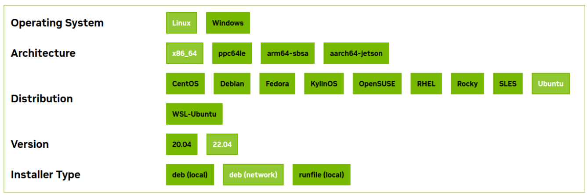

# gpt-docs-chat README

A simple llamaindex based project to install a local chatbot to answer questions about local files (PDFs or text files).

A local LLM is served up via ollama.
RAG (Retrieval Augmented Generation) is provided by llamaindex which requires min 32GB RAM.

privacy: The project does NOT use any remote services like Open AI or Amazon Bedrock, so the documents are kept private.

performance: an NVidia GPU can help speed up the performance (see [GPU support](#gpu-support) section at end)

# Setup [Unix or Mac]

note: on Windows, please use WSL - I use Ubuntu 22.04.

1. install python 3.12
2. install ollama

ref: https://ollama.com/download

Unix:

```
curl -fsSL https://ollama.com/install.sh | sh
```

note: this also installs graphics card (at least for NVidia)

For Mac see https://github.com/ollama/ollama

Download the LLM and the embedding model:

```
ollama pull llama3
ollama pull nomic-embed-text
```

You may need to start ollama:

```
ollama serve
```

3. install pipenv:

```
python -m pip install pipenv
```

# Install dependencies

```
pipenv clean
pipenv install --dev
```

# Place your data

Put your text and PDF files under the `data` folder.

# Run

```
./go.sh
```

or

```
pipenv run python -W "ignore" -m src.main
```

# Debugging

You can set breakpoints by adding Python code:

```
import pdb
pdb.set_trace()
```

# Trouble-shooting

- cannot run via pipenv: try with or without this prefix: `python -m`. note: the version of Python must match that in the Pipfile file.

# References

## LLMs

Ollama supports many LLM models - see https://github.com/ollama/ollama?tab=readme-ov-file#model-library

## GPU support

GPU support is not absolutely required with smaller LLMs, but if you have an NVidia GPU then it can improve the performance.

With ollama, GPU support should be taken care of. However if you use the LLM 'directly' for example via HuggingFace packages, then you may need to setup CUDA.

- Install CUDA [on Ubuntu]

ref https://www.cherryservers.com/blog/install-cuda-ubuntu#step-6-install-gcc

assumption: installing ollama has already installed the NVidia graphics driver.

```
nvidia-smi
```

This will output the graphics driver details - note the version of CUDA.

Install gcc:

```
sudo apt install gcc
gcc -v
```

Install CUDA toolkit Ubuntu - use [NVidia's website](https://developer.nvidia.com/cuda-downloads?target_os=Linux&target_arch=x86_64&Distribution=Ubuntu&target_version=22.04&target_type=deb_network) to generate the script.

The options for Ubuntu-22.04 are:



The NVidia website will generate an install script.

Adjust the end of the script to use your matching version of CUDA.

Run the script.

Reboot:

```
sudo reboot now
```

Edit your bashrc file:

```
nano ~/.bashrc
```

Add environment variables (adjust for your version of CUDA)

```
export PATH=/usr/local/cuda/bin${PATH:+:${PATH}}
export LD_LIBRARY_PATH=/usr/local/cuda-12.4/lib64\
                         ${LD_LIBRARY_PATH:+:${LD_LIBRARY_PATH}}

export CUDA_HOME=/usr/local/cuda-12.4
```

Press CTRL+O, save, then CTRL+X to exit.

Execute your bashrc to get the new environment variables:

```
. ~/.bashrc
```

Test that CUDA is working:

```
nvcc -V
```


- Install flash-attn

note: this can take a long time!

```
sudo apt-get install python3.12-dev

pip uninstall -y ninja && pip install ninja

python -m pip install flash-attn --no-build-isolation
```
